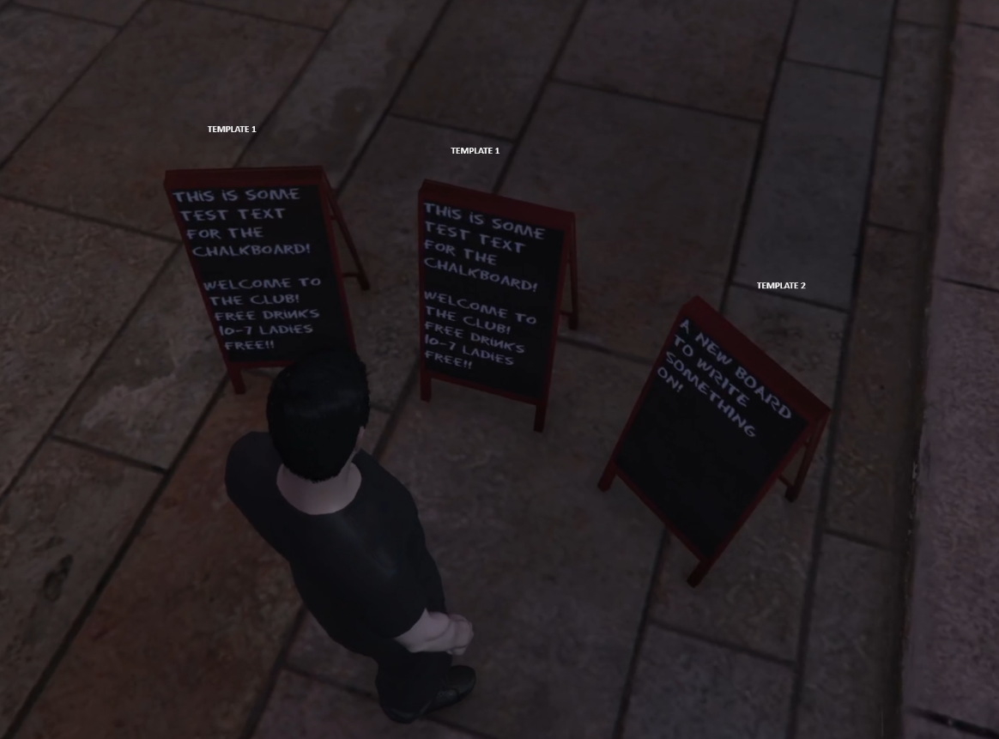
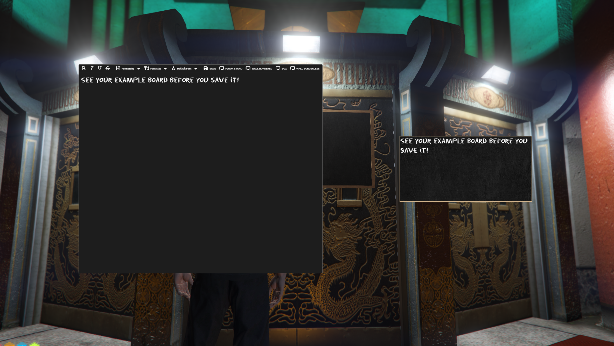

Chalkboards
===
A FiveM chalkboard system using DUI's and placed objects

## Video Example

https://github.com/Xilophinum/chalkboards/assets/44152393/c2be5efb-54cd-4323-b487-04d9e7f3c096

[Streamable Link](https://streamable.com/heh9gg)

## Information
Open source so you can customize which notifies, inventory, target etc. This is set up with the below dependencies. Alter to your liking.

Using an item will trigger a object placement system. Prior to placement you will be asked which template to use. There are 5 templates to an object. If you use the same template twice or more, the same board will be displayed as the original placed board. Or pick a different template and add a new board with its own board data!

After placement, you can target the board to interact with a WYSIWYG text editor, which a preview of your board as a toolbar option. Visually see what will be placed on the board. I have added open source "chalkboard" fonts for you to use to provide realism to the boards placed!

## Dependencies
- ox_lib
- ox_target
- ox_inventory 
- QBCore
- BzZzi Chalkboards - [FiveM Forum Post](https://forum.cfx.re/t/props-free-chalkboards/5227369)

## Issues
- Biggest problem is the use of chalkboards by two people, with the same model, around the radius of each other. This uses the ``AddReplaceTexture`` native, which means whoever edited last would overwrite the texture of the others board when nearby. This shouldnt be an issue if your player owned businesses are placing boards across town from each other, or outside the designated radius zone that is created when a board is placed.

- Prop 3/Chalkboard3 has its origin in the center of what seems to be a sphere, making it nearly impossible to place or be used with this resource.

- When placing objects, based on the surface the raycast is hitting, your object will blink in and out of existence. If you finish placement and the object is not visible, it will stay that way, and you will essentially "lose" the item. Unsure of a way to resolve. 
